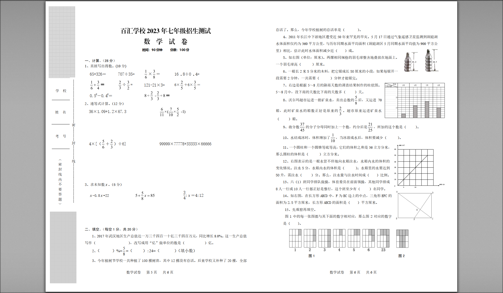
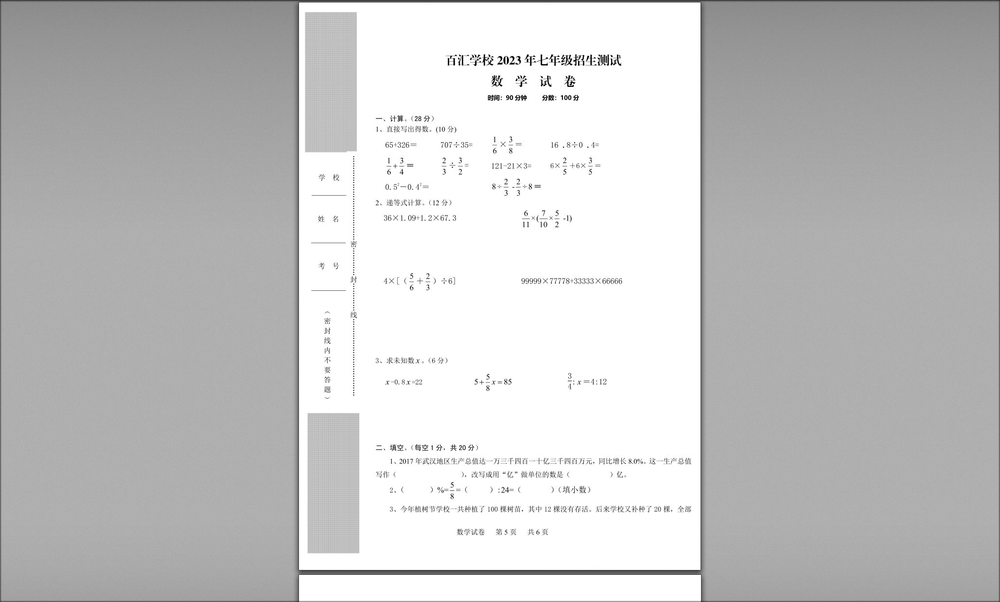

# 代码解决问题
试卷排版通常采用A3格式，但是家用打印机一般只能打印A4格式的纸张。直接打印会导致打印错位，采用缩印字体过小，因此最佳体验依然是通过A4纸张打印。

检索到的解决方案：
1. 利用打印机的比例方法缩印功能，借助打印的预览视图，人工调整
2. 利用PDF工具手动裁剪
3. 改变word分栏重新排版

已有解决方案存在手动操作且需要一定知识储备，各类软件的设置对于家长来说不胜其扰，因此采用一键式的exe可执行文件来实现

# 效果展示
## 原始PDF文件

## 裁剪后的PDF文件

# 使用提示
A3格式的PDF文件需要和exe文件放在同一目录下，执行exe文件后会自动生成裁剪后的PDF文件

# 依然存在的问题
V2.0代码存在的问题：
1. 打包成可执行文件的大小过大
2. 为保证分割后的PDF的高清晰度，执行速度较慢（未调整合适的放大比例，直接拉满最高清了）

# 代码贡献
1. ChatGPT
2. https://juejin.cn/post/7081099813743394852
3. zcongfly
